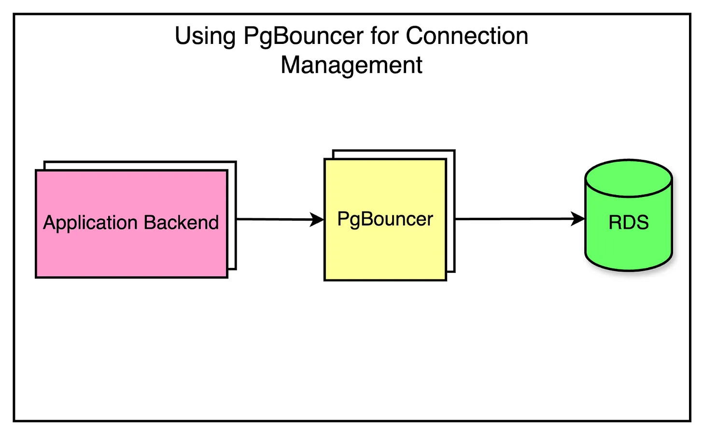

# Gracefully Shutdown Golang

Halo teman teman perkenalkan nama saya ariadi ahmad. kali ini saya akan share tentang gracefully shutdow in golang. oke lansung aja yaa.

## Yang Ingin Membantu Saya Untuk Terus Berkontribusi Boleh Banget Klik Dibawa**h** <a href="#9a3c" id="9a3c"></a>

[](https://trakteer.id/ariadi-ahmad-28xqo/tip)

### Apa Itu Gracefull Shutdown? <a href="#e603" id="e603"></a>

Gracefull shutdown sendiri adalah sebuah mekanisme dalam menutup koneksi dengan cara yang aman dan tepat. misalkan kalian punya sebuah permintaan untuk melakukan transfer uang dan tiba2 aplikasi di matikan di saat itu. apa yang terjadi. pasti berbahaya kan. maka disitulah gracefull shutdown hadir.

### Implementasi Di Golang Not Gracefull <a href="#9d07" id="9d07"></a>

Buat sebuah folder di project golang kalian dengan nama server\_not. buat sebuah file bernama server\_not.go. kita akan mencoba melihat apa yang terjadi jika tidak menggunakan server not gracefull.



Di root main kalian bisa menuliskan code berikut

.png>)

Yang Terjadi Seperti Ini

.png>)

Proses berhenti di tengah jalan dan transfer uang sudah di lakukan.

### Kita akan coba dengan gracefull shutdown <a href="#04ce" id="04ce"></a>

dengan membuat sebuah folder dengan nama server dan didalamnya ada sebuah file bernama server.go

.png>)

* Apa yang dilakukan di atas adalah. kita menggunnakan goroutine untuk menjalankan servernya

```go
server := http.Server{  
Addr:    "0.0.0.0:8080",  
Handler: router
}
serverErr := make(chan error, 1) 
go func() {  
log.Println("server listening on", server.Addr) 
 serverErr <- server.ListenAndServe() }
 ()
```

* kita membuat chanel untuk mendengarkan signal yang terjadi

```go
shutdownChannel := make(chan os.Signal, 1)
signal.Notify(shutdownChannel, syscall.SIGINT)
```

* Kita melakukan select untuk melihat signal apa yang terjadi. jika chanel menerima signal shutdown atau interupt kita melakukan gracefull shutdown selama 10 detik untuk menunggu process diselesaikan dengan baik.

```go
select { case sig := <-shutdownChannel: 
 log.Println("signal:", sig)
 const timeout = 10 * time.Second  
 ctx, cancel := context.WithTimeout(context.Background(), timeout) 
  defer cancel()
 if err := server.Shutdown(ctx); 
 err != nil {   server.Close()  
 } 
 case err := <-serverErr:  
 if err != nil {   log.Fatalf("server: %v", err)  
 } 
 }
```

Kita lihat hasilnya

<figure><figcaption></figcaption></figure>

lihat kita mencoba melakukan `ctrl c` atau interupt ditengah request. dan berhasil menyelesaikan request dengan baik.\
_Note : kenapa angakanya gak muncul karena saya salah memasukkan data parameter get HEADER_

```
X-REQUEST-MONEY
```

## Yang Ingin Membantu Saya Untuk Terus Berkontribusi Boleh Banget Klik Dibawah <a href="#0545" id="0545"></a>

[](https://trakteer.id/ariadi-ahmad-28xqo/tip)

itulah sedikit sharingnya semoga membantu teman teman.

\
