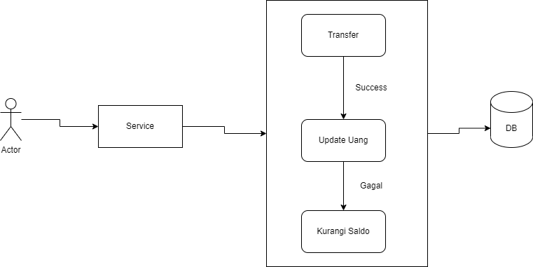

# Kenapa Menggunakan Transaction di DB

Halo semua. kali ini saya akan berbagi opini berdasarkan pengalaman saya tentang penggunaan transaction di DB khususnya di Postgres. menurut saya ini penting untuk di bahas untuk menambah pengetahuan kita tentang db.

## Yang Ingin Membantu Saya Untuk Terus Berkontribusi Boleh Banget Klik Dibawah 

**Apa Itu Transaction?**

Transaction sendiri adalah sebuah metode yang di ciptakan di db yang menggunakan SQL untuk menangani proses apabila terjadi kegagalan di salah satu node maka proses yang lainya akan dibatalkan. hal ini bertujuan untuk menanganani inconsistensi data dalam DB.

**Properti Dalam Transaction**

*   Begin

    digunakan untuk memulai proses dalam db
*   Commit

    di  gunakan apabilah proses telah sukses di lakukan dan tidak terjadi kegagalan
*   Rollback

    digunakan untuk mengembalikan semua proses apabila terjadi kegagalan data

Kasus Kegagalan jika tidak menggunakan Transaction

<figure><figcaption></figcaption></figure>

Lihat proses di atas. jika tidak menggunakan transaction. kita sudah melakukan transfer ketika mengurangin saldo ternyata terjadi kegagalan. sangat berbahaya bukan jika kita tidak menggunakan transaction.

**Kapan Menggunakan Transaction?**

* Ketika itu adalah proses data bergerak, seperti create,delete,update
* Jika proses data itu harus menghasilkan consistensi data
* Jika proses data itu saling mempengaruhi proses yang lain

## Yang Ingin Membantu Saya Untuk Terus Berkontribusi Boleh Banget Klik Di Bawah 

Referensi

* [https://www.postgresql.org/docs/current/tutorial-transactions.html](https://www.postgresql.org/docs/current/tutorial-transactions.html)
* [https://dev.mysql.com/doc/refman/8.0/en/commit.html](https://dev.mysql.com/doc/refman/8.0/en/commit.html)

Mungkin itu aja ya teman-teman. Terimah kasih
